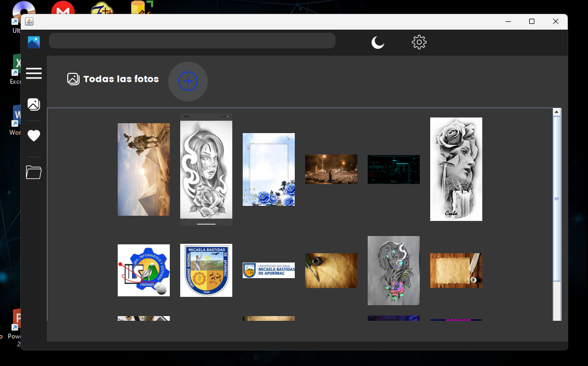

# Galeria_Java
Galeria de archivos(imagenes) de escritorio en Java, esta version esta al 50%.
- (`EN PROCESO ...`)

### ✨ Funcionalidades hasta el momento

- **Añadir imagenes**: Añade multiples imagenes desde tu explorador de archivos.
- **Ver imagenes**: vea imagenes en un JDialog.
- **Adelantar y retroceder**: Adelante y retroceda las imagenes que previamente subio.
- **Eliminar**: Elimine imagenes.
- **Zoom imagen**: realice zoom a la imagen a su preferencia.
- **Arrastrar imagen**: funcion de arrastre de imagen despues de realizar el zoom.
- **Cambiar tema**: Cambio de tema oscuro/claro.

### ⚙️ Características Técnicas

- **Lenguaje**: Java
- **Interfaz Gráfica**: Swing.
- **Subir imagenes a traves de**: (`JFileChooser`)
- **Entorno de Programación**: Apache NetBenas IDE 18

## 🖼️ Capturas de Pantalla

